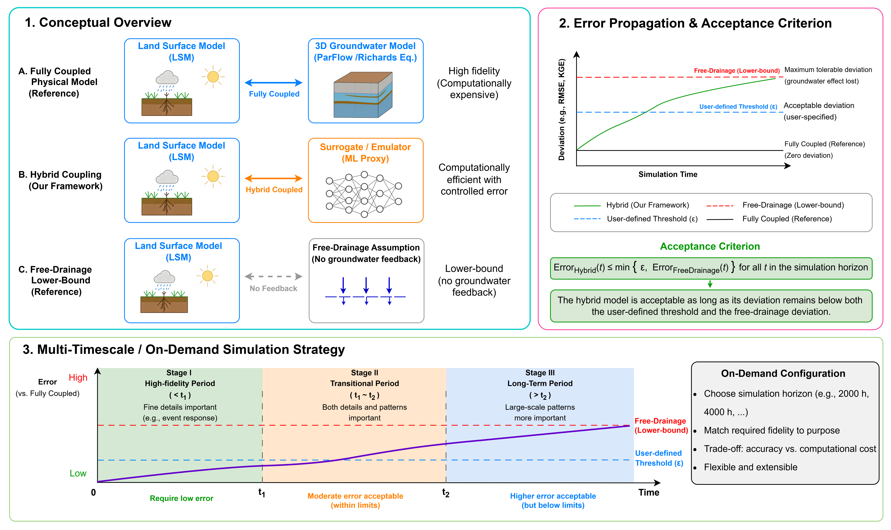

# A Hybrid Physics–ML Framework for Integrating Groundwater Dynamics into Land Surface Modeling  
See our preprint: [DOI: 10.31223/X5PR3B](https://doi.org/10.31223/X5PR3B)

  

This figure provides an overview of the hybrid framework. It contrasts different modeling approaches, defines an error acceptance criterion, and presents a multi-timescale strategy to achieve a balance between physical fidelity and computational efficiency.

Please try following the instructions below. If you have any questions, feel free to contact me at yangch329@mail.sysu.edu.cn. We will update this repository promptly based on any useful feedback you provide.

## Repository Structure
**clm_cbind**: Makefile and Fortran (.F90) source files used to compile `libclm_lsm.so`, which is invoked by the ParFlow surrogate model. A test script (`demo_lsm.py`) is provided to verify that the library is built correctly. The compiled `.so` has already been copied to `core/model`. This directory is only needed if you want to recompile the shared library.  
**core**: Source code of the hybrid physics–ML coupling system.  
**full_year_run**: Slurm job script for the full-year hybrid simulations used in the paper.  
**CoLM_nlfile.nml**: CoLM configuration file specifying the simulation period.  
**CoLM_readin.dat**: CoLM input file containing soil properties and land cover information for the modeling domain.  
**snicar_par.dat**: CoLM input file; keep this file in the current directory.  
  
**other_inputs**:
- **ERA5_forcings**: 48-hour ERA5-Land meteorological forcing data for the test case.
- **restart_files**: Required for hot-start initialization at the end of water year 2020 (WY2020).
- **trained_model**: Pretrained surrogate model used in the hybrid system.  
- **targets_path**: Directory containing static property files and the initial condition (e.g., `press.00000.pfb`), to be specified by `--targets_path`.
- **static_inputs_combined46.pfb**: Static input file containing 46 static attributes.
- **stats_press_evap2.yaml**: Mean and standard deviation for exchange fluxes and pressure head.

**pfnn_script**:
- **predrnn_pfnn.sh**: Main execution script. Once all inputs are prepared, run `sh predrnn_pfnn.sh`.

## Path Configuration Notes

The following arguments in **predrnn_pfnn.sh** require user-specific path configuration:
- `--save_dir`, `--gen_frm_dir`: Output directories for checkpoints and generated results. Please set these to your desired locations on your local machine.
- `--static_inputs_filename`, `--norm_file`: These files are provided in the `other_inputs` directory of this repository.
- `--static_inputs_path`: Path to `static_inputs_combined46.pfb`. Please set this to the location of the file on your local machine.
- `--targets_path`: Directory containing the static property files and the initial condition (e.g., `press.00000.pfb`). The required files are provided under `other_inputs/targets_path`; please set this to the corresponding path on your local machine.
- `--pretrained_model`: Located in `other_inputs/trained_model`. Please set this to the corresponding path on your local machine.
- `--lsm_forcings_path`: Located in `other_inputs/ERA5_forcings`. Please set this to the corresponding path on your local machine.

The following arguments are not required for the hybrid system in this test case and can remain unchanged:
- `--forcings_path`, `--forcings_paths`, `--targets_paths`

## Example Run

After preparing all required inputs, execute:

```bash
cd your_path/pfnn_script
sh predrnn_pfnn.sh